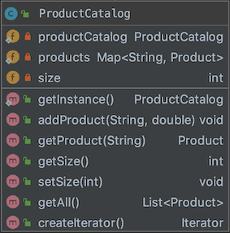
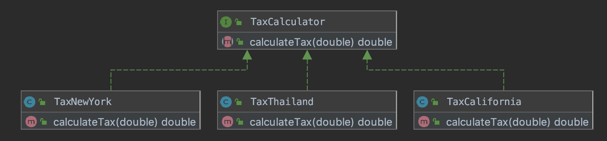
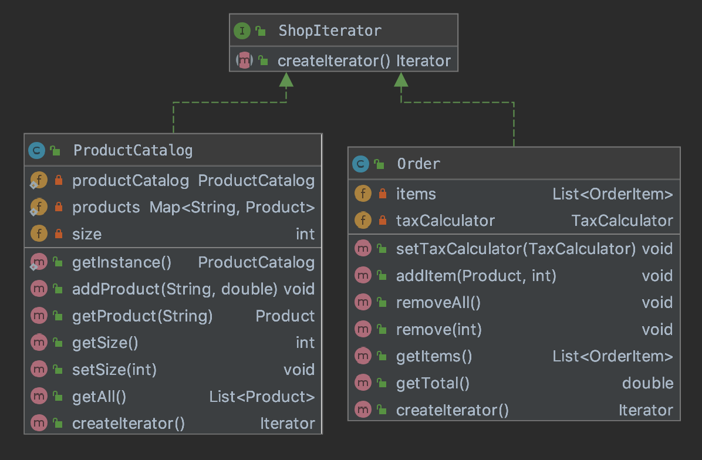
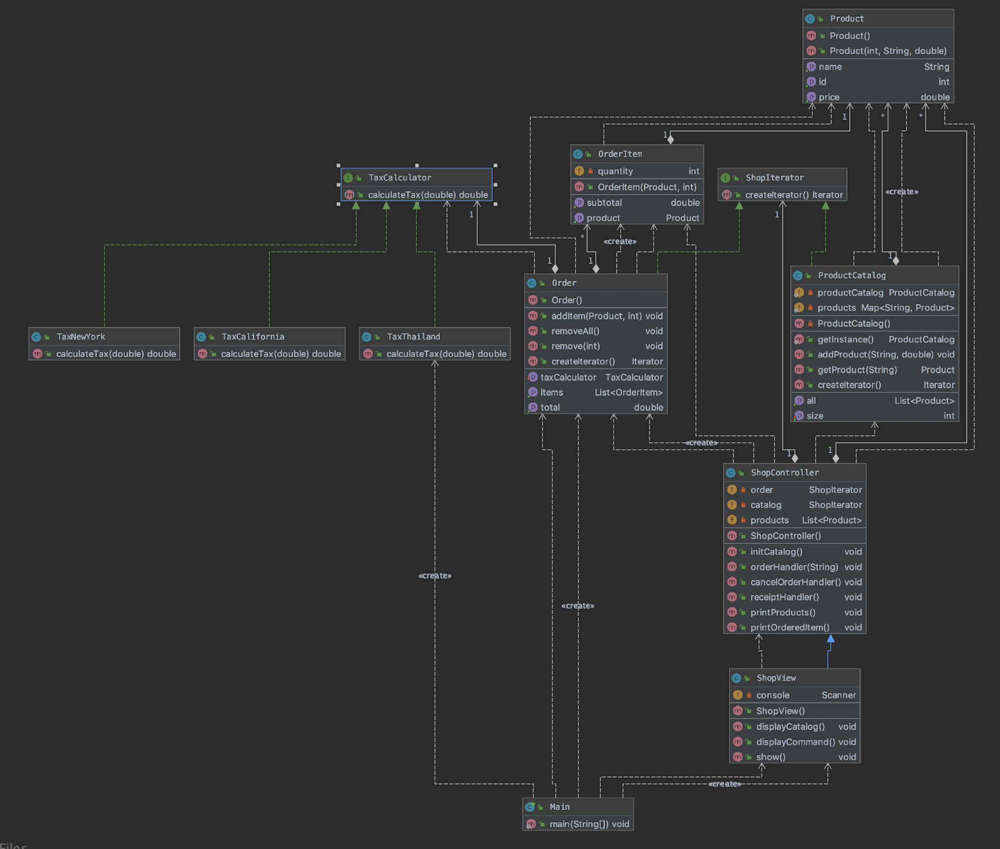

# SKE Shop

An ordering system for a product shop which user can order the product and checkout to see the receipt.
Moreover, it provides a tax calculator which calculate differently depending on the location of the shop.

## How to use
As a user, you are the customer of the SKE shop.

**User interface**

    __________ WELCOME TO THE SKE SHOP __________

    Product                               Price
    [1] Pizza                             250.00
    [2] Ham                                40.00
    [3] Steak                             200.00
    [4] Bread                              20.00

    [c] Cancel order
    [e] Review order and checkout

**Functionality**

    User can input:
    
        [number] to place an order.
        [c] to cancel order.
        [e] to review order and checkout.

## Design Pattern

#### Singleton design pattern
    The application can only contain one product catalog for ordering.

   
#### Strategy design pattern
    Tax calculator can have many strategies for calculating tax.

#### Iterator design pattern
    The application requires to maintain a different type of collections.

## Model-View-Controller

#### Model

    ProductCatalog manages the Product object.
    OrderItem is a Product with quantity.
    Order manages the OrderItem.

#### View
    
    ShopView is responsible for displaying a model object in console format.

#### Controller

    ShopController is responsible for handling the user input and performing interactions on the data model objects.
    
## UML Diagram
    

## Developer

   Vichaphol Thamsuthikul #6010545897

